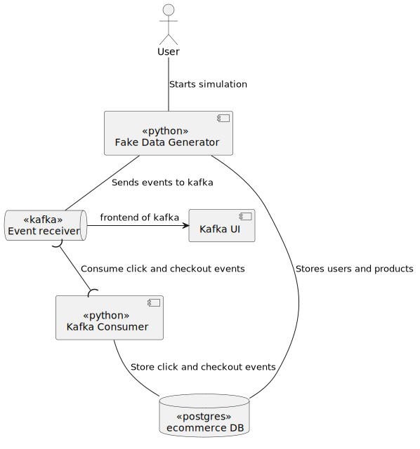

# eccomerce-streaming-demo
STILL IN PROGRESS.
## Project Description
This project demonstrates an ecommerce data generation system that utilizes Docker and Docker Compose to set up and orchestrate various services. It generates fake ecommerce data, stores it in a PostgreSQL database, and sends events like clicks and checkouts to Apache Kafka.

It also includes a Kafka UI to monitor Kafka messages.

## Architecture

## Prerequisites
- Docker and Docker Compose

## How to run
- Start Docker.
- run `make start`
- (optional) open `localhost:8181` to monitor kafka.

