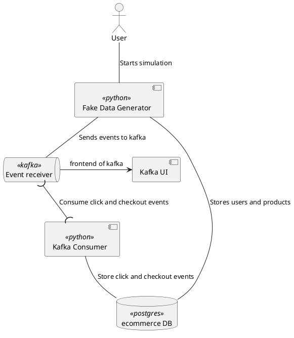

```plantuml
@startuml
actor "User" as user
component "Fake Data Generator" as datagen <<python>>
component "Kafka Consumer" as consumer <<python>>
database "ecommerce DB" as db <<postgres>>
queue "Event receiver" as kafka <<kafka>>
component "Kafka UI" as kafka_ui

user -- datagen: Starts simulation
datagen -- db: Stores users and products
datagen -- kafka: Sends events to kafka
kafka -> kafka_ui: frontend of kafka
kafka )--( consumer: Consume click and checkout events
consumer -- db: Store click and checkout events
@enduml
```